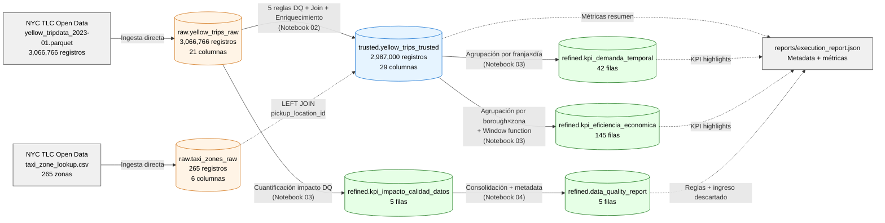
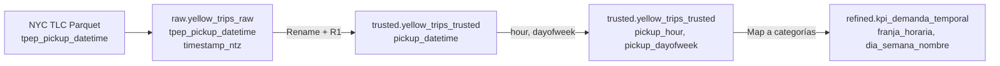
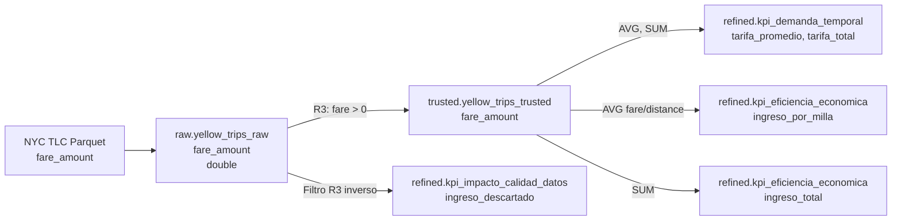
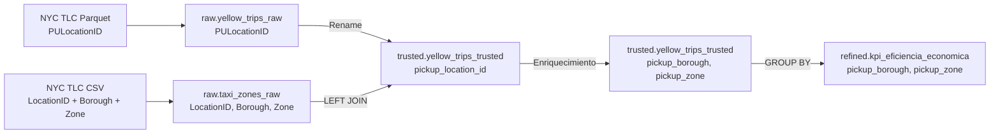

# Linaje de datos del pipeline

Este documento describe el flujo de datos del pipeline ETL Medallion: cómo cada campo fluye desde la fuente hasta los KPIs finales, qué transformaciones sufre, y dónde reside en cada capa.

---

## Diagrama de linaje general

---

## Linaje detallado de los 3 CDEs

### CDE 1: `pickup_datetime`

**Transformaciones aplicadas:**
1. **Raw → Trusted:** renombre `tpep_pickup_datetime` → `pickup_datetime`. Validación R1 (debe ser menor que `dropoff_datetime`).
2. **Trusted (mismo nivel):** derivación de `pickup_hour = hour(pickup_datetime)` y `pickup_dayofweek = dayofweek(pickup_datetime)`.
3. **Trusted → Refined:** mapeo a categorías legibles con `F.when()` (6 franjas horarias, 7 días en español).

### CDE 2: `fare_amount`

**Transformaciones aplicadas:**
1. **Raw → Trusted:** validación R3 (debe ser > 0). Los registros con `fare ≤ 0` se descartan pero se cuantifican para KPI 3.
2. **Trusted → Refined.kpi_demanda_temporal:** agregaciones por franja×día (`AVG`, `SUM`).
3. **Trusted → Refined.kpi_eficiencia_economica:** cálculo de `ingreso_por_milla = AVG(fare_amount / trip_distance)`.
4. **Raw → Refined.kpi_impacto_calidad_datos:** lectura directa de Raw para cuantificar lo descartado.

### CDE 3: `pickup_location_id`

**Transformaciones aplicadas:**
1. **Raw → Trusted:** renombre `PULocationID` → `pickup_location_id`. LEFT JOIN con `taxi_zones_raw` para enriquecer con `Borough` y `Zone`.
2. **Trusted (mismo nivel):** las columnas `pickup_borough` y `pickup_zone` quedan disponibles junto al ID.
3. **Trusted → Refined:** agrupación por `(pickup_borough, pickup_zone)` con cálculo de métricas económicas.

---

## Notas técnicas sobre el linaje

### Por qué LEFT JOIN y no INNER JOIN con `taxi_zones_raw`

Se eligió **LEFT JOIN** en lugar de INNER JOIN para no perder viajes cuyo `pickup_location_id` no tuviera match en el lookup. Los viajes sin match quedan con `pickup_borough = NULL` y se reportan en métricas de DQ, en lugar de ser descartados silenciosamente. En este pipeline la cobertura fue del 100%, pero el LEFT JOIN es defensivo para producción.

### Particionamiento físico

La tabla `trusted.yellow_trips_trusted` está particionada físicamente por **`pickup_date`** (34 particiones — los 31 días de enero + 3 particiones extra de timestamps fuera del rango esperado, comportamiento típico de datos TLC). Esto optimiza consultas que filtran por fecha en la capa Refined.

Las tablas Refined no están particionadas porque son pequeñas (42, 145, 5 filas) — el particionamiento agregaría overhead sin beneficio.

### Trazabilidad por `pipeline_run_id`

Cada ejecución del pipeline genera un UUID único que se persiste en:
- Columna `pipeline_run_id` de `refined.data_quality_report`
- Campo `execution_metadata.execution_id` en `reports/execution_report.json`

Esto permite reconstruir qué versión del pipeline produjo qué reportes — base para auditoría y debugging en producción.

---

## Evolución del linaje a producción

En un entorno productivo, este linaje se documentaría adicionalmente en:

- **Unity Catalog Lineage:** UC genera linaje automático en SQL queries y transformaciones PySpark. Visible en la pestaña "Lineage" de cada tabla del Catalog Explorer.
- **OpenLineage / Marquez:** estándar abierto para capturar linaje de pipelines de datos. Se integra con Spark y Airflow.
- **Data catalog tool externo:** Alation, Collibra, DataHub para gobierno avanzado y descubrimiento de datos para no técnicos.